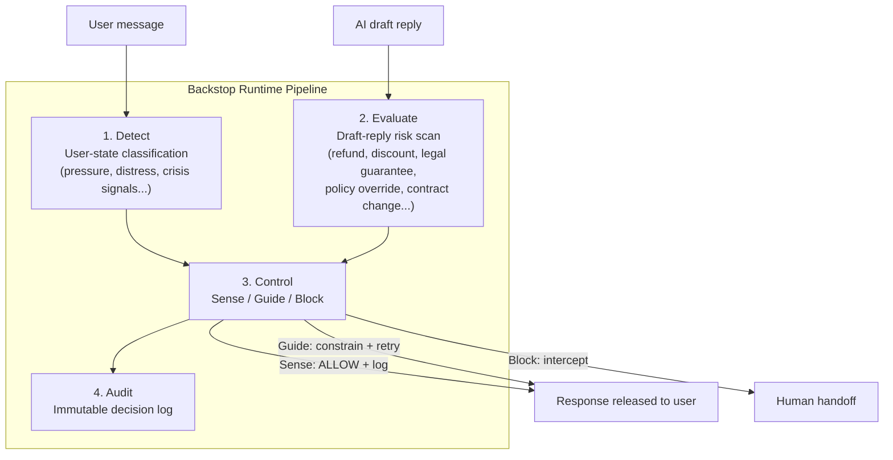

# Architecture

Backstop is a **Runtime Enforcement Gateway** that sits between a customer-facing AI agent and the end user. It does not modify, retrain, or replace the underlying LLM — it evaluates traffic in and out of it, in real time.

中文版：[ARCHITECTURE.zh-TW.md](./ARCHITECTURE.zh-TW.md)

---

## Design Principles

1. **Non-invasive.** Backstop plugs in via API. No changes to the existing model, prompt chain, or infrastructure are required.
2. **Rule-based, not semantic — by design, for now.** Detection currently relies on pattern matching (regex + keyword rules), not LLM-based semantic understanding. This is a deliberate tradeoff: pattern matching is fast (see [Performance](#performance) below), cheap to run at scale, and fully deterministic — the same input always produces the same decision, which matters for auditability. The tradeoff is coverage: novel phrasing not yet in the rule set can be missed. Known gaps and current coverage are tracked in [REGRESSION_CHECKLIST_P1.md](./docs/REGRESSION_CHECKLIST_P1.md).
3. **Fail conservative.** When a request cannot be evaluated with confidence, the system routes to human handoff rather than silently allowing it through.
4. **Tenant-isolated.** Each customer (tenant) has its own policy profile, event log path, and strictness configuration. One tenant's data and rules never leak into another's. An unmapped/unknown `tenant_id` is rejected outright (`403`), not silently processed.
5. **Shadow-first adoption.** Governance can be turned on in observe-only mode before it ever blocks a real response, so adoption carries no production risk.

---

## The Four Layers

### 1. Detect
Classifies the *user's* message into one of six high-risk interaction states (e.g. high-pressure escalation, emotional distress, ambiguous uncertainty, crisis signals). This layer runs on the inbound side — before the AI has even drafted a reply — and is currently used as a routing/context signal rather than a standalone blocking trigger.

### 2. Evaluate
Scans the *AI's draft reply* (`ai_draft`) for unauthorized commitments across six categories: refund, discount, compensation, legal guarantee, policy override, and contract modification. This is the layer with the highest commercial stakes — it's what stands between an AI agent and a promise the business never authorized. Requires the caller to pass `ai_draft` alongside `user_text`; if no draft is supplied, this layer has nothing to evaluate.

### 3. Control
Takes the outputs of Detect and Evaluate and resolves them into one of three governance modes:

| Mode | Behavior |
|---|---|
| 🟢 **Sense** (`ALLOW`) | Pass-through, logged for audit |
| 🟡 **Guide** (`GUIDE`) | Response constrained/redirected before release |
| 🔴 **Block** (`BLOCK`) | Response intercepted, routed to human handoff |

In **Shadow Mode** (`X-Governance-Mode: Shadow`), Control always resolves the *externally enforced* decision to `ALLOW` — nothing is ever blocked — while still recording what the decision *would have been* (`observed_final_decision_state`) for later review.

### 4. Audit
Every evaluated interaction produces an immutable record: trigger source (`user` / `ai_draft` / `both`), risk label, reason code, decision, and a UTC timestamp. This is the layer that turns "we have governance" into "we can prove what happened and when."

### Concept Layers vs. Implementation Modules
Detect / Evaluate / Control / Audit are **conceptual layer names** used in this document for readability — they are not literal module or file names in the codebase. For readers doing technical due diligence, the mapping to implementation (confirmed current as of this writing) is:

| Concept layer | Implementation | Notes |
|---|---|---|
| Detect (crisis signals) | `core/safety_gate.py` | Crisis/out-of-scope detection via `check_out_of_scope(...)` |
| Detect (tone classification) | `core/classifier.py` | Classification score is combined with rhythm signals from `core/rhythm_analyzer.py` |
| Evaluate | `core/commitment_guard.py` + `configs/commitment_rules.yaml` | Rule groups are named by commitment type (e.g. `refund_commitment`, `compensation_commitment`) |
| Control (`analyze_dual`) | `core/dual_orchestrator.py` | Dual-path (user + AI draft) decision resolution |
| Control (`analyze`, single-path) | `pipeline/z1_pipeline.py` + `core/router.py` | |

Naming differences between the concept layer and the implementation are expected and don't indicate a mismatch between this document and the code. This document does not disclose regex/keyword lists, confidence thresholds, allowlist logic, or anti-evasion rules — those remain internal.

---

## Explainability

When a single call to `/api/v1/analyze` or `/api/v1/analyze_dual` resolves to `GUIDE`/`BLOCK`, the **API response itself immediately includes** a `shadow_explainability` field (`mode: "summary_only"`) — risk type, reason code, a recommended strategy, and suggested required phrasing. No wait until the Day 14 report is required. The same summary content also surfaces in the `/api/v1/metrics/shadow_observations` and `/api/v1/reports/risk_14d` report endpoints (as `observed_guidance_summary`) for later review.

This summary is intentionally a **redacted view**: the full internal instruction set used to construct AI guidance (`assistant_instruction`) is retained internally only — the public-facing field is always `null`, even in Shadow Mode.

---

## Performance

Measured against the production deployment (cloud-to-cloud, 2026-07-31):

| Scenario | P95 latency |
|---|---|
| Single-path `/analyze` (sequential) | 91ms |
| Dual-path `/analyze_dual` (sequential, by scenario) | 119–134ms |
| Dual-path `/analyze_dual` (5 concurrent) | 350ms |

Throughput at 5 concurrent requests: ~19.9 req/s, 0% error rate across all tested scenarios. These figures exclude client-side network variance and reflect a single-day benchmark, not a longitudinal SLA.

---

## Multi-Tenancy

Each tenant is bound to a `tenant_id` → policy profile mapping on the backend. A tenant's:
- event log path,
- policy strictness (e.g. a given category can be set to `GUIDE` for one tenant and `BLOCK` for another),
- and Shadow Mode on/off state,

are all configured independently. Cross-tenant data leakage is prevented at the routing layer — an unrecognized `tenant_id` fails closed rather than falling back to a default.

---

## What's Public vs. What Isn't

This document describes the shape of the system — how data flows, what each layer is responsible for, and how to integrate against it. It does not include:

- the underlying rule/pattern definitions,
- policy profile configurations,
- or any tenant-specific data.

See [CONTRACT_V1.md](./CONTRACT_V1.md) for the request/response data contract, and [PARTNER_INTEGRATION_GUIDE.md](./docs/PARTNER_INTEGRATION_GUIDE.md) for integration steps.
